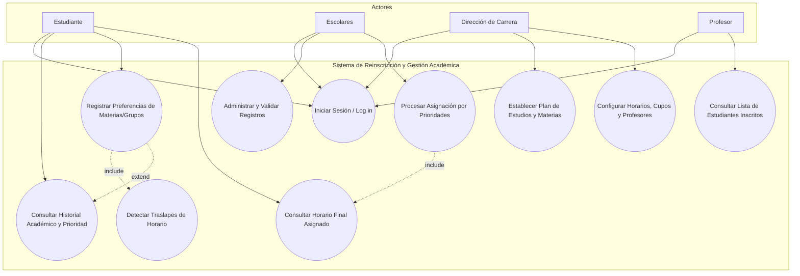

# Sistema de Reinscripción y Gestión Académica Centralizada

Plataforma web enfocada en optimizar, centralizar y reestructurar el proceso de reinscripción escolar mediante un modelo flexible basado en **preferencias y prioridades**, diseñado principalmente para solucionar los problemas de saturación, dispersión de información y ventanas de tiempo reducidas en instituciones educativas (caso de estudio: FES Acatlán - UNAM)[cite: 1].

---

## 📌 Problemática Afrontada

El proceso tradicional de reinscripción suele presentar restricciones operativas e interactiva significativas[cite: 1]:
* **Ventanas de tiempo reducidas:** Periodos limitados (ej. 15 minutos) donde los estudiantes deben tomar decisiones rápidas ante la disponibilidad cambiante de cupos[cite: 1].
* **Información descentralizada:** Horarios, historial y trámites distribuidos en múltiples plataformas con credenciales independientes[cite: 1].
* **Incertidumbre en la planificación:** La pérdida de un grupo clave obliga a reestructurar el horario completo bajo presión[cite: 1].

### 💡 Solución Propuesta
Un entorno web centralizado donde el estudiante puede consultar su información académica en un solo lugar y registrar con anticipación un listado ordenado de **preferencias de materias/grupos**[cite: 1]. El sistema procesa estas preferencias considerando prioridades del alumno, reglas académicas y compatibilidad de horarios, reduciendo la saturación en tiempo real y mejorando la experiencia de usuario[cite: 1].

---

## 🛠️ Tecnologías Utilizadas

* **Frontend:** [React](https://react.dev/)[cite: 1]
* **Lenguaje:** JavaScript (ES6+)[cite: 1]
* **Modelado y Documentación:** UML / Mermaid[cite: 1]

---

## 👥 Actores del Sistema

| Actor | Descripción / Rol |
| :--- | :--- |
| **Alumno / Estudiante** | Consulta su historial académico, analiza traslapes y registra su orden de preferencia de materias y grupos[cite: 1]. |
| **Dirección de Carrera** | Configura el plan de estudios activo, define la oferta académica (materias, horarios, cupos) y asigna profesores[cite: 1]. |
| **Administración Escolar** | Intermediarios y *bookkeepers* que gestionan los registros, coordinan el proceso y validan la asignación general por prioridades[cite: 1]. |
| **Profesor** | Consulta la información básica y las listas definitivas de los estudiantes inscritos en sus grupos asignados[cite: 1]. |

## Requerimientos funcionales

Los siguientes requerimientos definen las funcionalidades principales del sistema de reinscripción y las acciones que podrán realizar los diferentes usuarios del sistema.

### Alumno

* **RF-01:** El sistema deberá permitir a los usuarios iniciar sesión.
* **RF-02:** El alumno deberá poder consultar las materias que puede cursar.
* **RF-03:** El alumno deberá poder seleccionar las materias que desea cursar.
* **RF-04:** El alumno deberá poder consultar los grupos disponibles para cada materia.
* **RF-05:** El alumno deberá poder establecer un orden de preferencia entre los grupos de cada materia.
* **RF-06:** El sistema deberá validar que el alumno cumpla los prerrequisitos de las materias seleccionadas.
* **RF-07:** El sistema deberá detectar conflictos entre los horarios de los grupos.
* **RF-08:** El sistema deberá verificar el cupo disponible de los grupos.
* **RF-09:** El sistema deberá asignar grupos considerando las preferencias del alumno.
* **RF-11:** El sistema deberá generar el horario final del alumno.

### Director de carrera

* **RF-12:** El director de carrera deberá poder crear y modificar planes de estudio.
* **RF-13:** El director de carrera deberá poder crear y modificar grupos.
* **RF-14:** El director de carrera deberá poder asignar profesor, horario y cupo a un grupo.

### Escolares

* **RF-15:** Escolares deberá poder consultar los registros de inscripción.
* **RF-16:** Escolares deberá poder validar los registros de inscripción.

### Profesor

* **RF-17:** El profesor deberá poder consultar su horario.
* **RF-18:** El profesor deberá poder consultar los alumnos inscritos en sus grupos.

# Requerimientos de Usuario

Los requerimientos de usuario describen las acciones que cada tipo de usuario debe poder realizar dentro del sistema de inscripción.

## 1. Alumno

| ID        | Requerimiento                     | Pasos                                                                                                                                                                                |
| --------- | --------------------------------- | ------------------------------------------------------------------------------------------------------------------------------------------------------------------------------------ |
| **RU-01** | Iniciar sesión                    | 1. Ingresar número de cuenta/usuario.<br>2. Ingresar contraseña.<br>3. Seleccionar **Iniciar sesión**.                                                                               |
| **RU-02** | Consultar información académica   | 1. Ingresar al sistema.<br>2. Consultar carrera, semestre, plan de estudios y materias disponibles.                                                                                  |
| **RU-03** | Consultar materias disponibles    | 1. Seleccionar **Inscripción**.<br>2. Consultar las materias que puede cursar.<br>3. Consultar los grupos disponibles de cada materia.                                               |
| **RU-04** | Seleccionar materias              | 1. Seleccionar una materia.<br>2. Agregarla a la solicitud de inscripción.<br>3. Repetir el proceso con las demás materias que desea cursar.                                         |
| **RU-05** | Priorizar grupos                  | 1. Seleccionar una materia.<br>2. Consultar sus grupos disponibles.<br>3. Seleccionar los grupos de preferencia.<br>4. Asignar un orden de prioridad a cada grupo: **1, 2, 3, etc.** |
| **RU-06** | Revisar solicitud                 | 1. Acceder al resumen de inscripción.<br>2. Revisar las materias seleccionadas.<br>3. Revisar las prioridades asignadas a los grupos.<br>4. Modificar la selección si es necesario.  |
| **RU-07** | Confirmar solicitud               | 1. Revisar la solicitud de inscripción.<br>2. Confirmar que la información sea correcta.<br>3. Seleccionar **Confirmar solicitud**.                                                  |
| **RU-08** | Consultar resultado de asignación | 1. Acceder a la sección de resultados.<br>2. Consultar las materias y grupos que fueron asignados.                                                                                   |
| **RU-09** | Consultar horario                 | 1. Acceder a **Mi horario**.<br>2. Consultar las materias, grupos, profesores, días y horarios asignados.                                                                            |

## 2. Director de carrera

El Director de carrera administra la información académica necesaria para que el proceso de inscripción pueda realizarse.

| ID        | Requerimiento                | Pasos                                                                                                                                        |
| --------- | ---------------------------- | -------------------------------------------------------------------------------------------------------------------------------------------- |
| **RU-10** | Iniciar sesión como Director | 1. Ingresar sus credenciales.<br>2. Seleccionar **Iniciar sesión**.                                                                          |
| **RU-11** | Administrar plan de estudios | 1. Acceder a **Plan de estudios**.<br>2. Consultar las materias del plan.<br>3. Agregar, modificar o eliminar materias cuando corresponda.   |
| **RU-12** | Administrar materias         | 1. Seleccionar una materia.<br>2. Consultar sus datos.<br>3. Registrar o modificar la información correspondiente.                           |
| **RU-13** | Administrar grupos           | 1. Seleccionar una materia.<br>2. Crear o modificar sus grupos.<br>3. Definir grupo, profesor, horario y cupo.                               |
| **RU-14** | Administrar horarios y cupos | 1. Seleccionar un grupo.<br>2. Definir o modificar su horario.<br>3. Establecer el número de lugares disponibles.<br>4. Guardar los cambios. |

## 3. Personal de Escolares

El personal de Escolares tiene funciones de consulta y control de la información relacionada con el proceso de inscripción.

| ID        | Requerimiento                             | Pasos                                                                                                                            |
| --------- | ----------------------------------------- | -------------------------------------------------------------------------------------------------------------------------------- |
| **RU-15** | Iniciar sesión como personal de Escolares | 1. Ingresar sus credenciales.<br>2. Seleccionar **Iniciar sesión**.                                                              |
| **RU-16** | Consultar información de inscripción      | 1. Acceder al módulo de inscripción.<br>2. Buscar un alumno o grupo.<br>3. Consultar su información de inscripción y asignación. |
| **RU-17** | Consultar información académica           | 1. Buscar al alumno o grupo correspondiente.<br>2. Consultar la información registrada en el sistema.                            |

## 4. Profesor

El profesor cuenta principalmente con funciones de consulta relacionadas con los grupos que tiene asignados.

| ID        | Requerimiento                | Pasos                                                                                                            |
| --------- | ---------------------------- | ---------------------------------------------------------------------------------------------------------------- |
| **RU-18** | Iniciar sesión como profesor | 1. Ingresar sus credenciales.<br>2. Seleccionar **Iniciar sesión**.                                              |
| **RU-19** | Consultar grupos asignados   | 1. Ingresar al sistema.<br>2. Consultar las materias y grupos que tiene asignados.<br>3. Consultar sus horarios. |
| **RU-20** | Consultar alumnos inscritos  | 1. Seleccionar uno de sus grupos.<br>2. Consultar la lista de alumnos asignados al grupo.                        |

## Flujo general del sistema

### Alumno

```text
Iniciar sesión
      ↓
Consultar materias disponibles
      ↓
Seleccionar materias
      ↓
Seleccionar grupos
      ↓
Asignar prioridades
      ↓
Revisar solicitud
      ↓
Confirmar solicitud
      ↓
El sistema realiza la asignación
      ↓
Consultar resultado
      ↓
Consultar horario
```

### Director de carrera

```text
Iniciar sesión
      ↓
Administrar plan de estudios
      ↓
Administrar materias
      ↓
Crear / modificar grupos
      ↓
Definir profesores, horarios y cupos
      ↓
Guardar información
```

### Personal de Escolares

```text
Iniciar sesión
      ↓
Consultar información de alumnos y grupos
      ↓
Consultar información de inscripción
```

### Profesor

```text
Iniciar sesión
      ↓
Consultar grupos asignados
      ↓
Consultar horario
      ↓
Consultar alumnos inscritos
```

## Consideraciones

* El **alumno establece sus preferencias**, pero no decide directamente qué alumno obtiene un grupo.
* La **asignación de grupos es realizada por el sistema** de acuerdo con las reglas de prioridad establecidas.
* El sistema busca reducir la dependencia de una ventana de inscripción limitada y evitar que el alumno tenga que seleccionar rápidamente cualquier grupo disponible.
* El alumno puede establecer un **orden de prioridad entre los grupos** de cada materia.
* Los requerimientos **RF-10 y RF-19** fueron excluidos de la propuesta y, por lo tanto, no se contemplan dentro de estos requerimientos de usuario.


# Sistema de Reinscripción y Gestión Académica

## Diagrama de Casos de Uso


